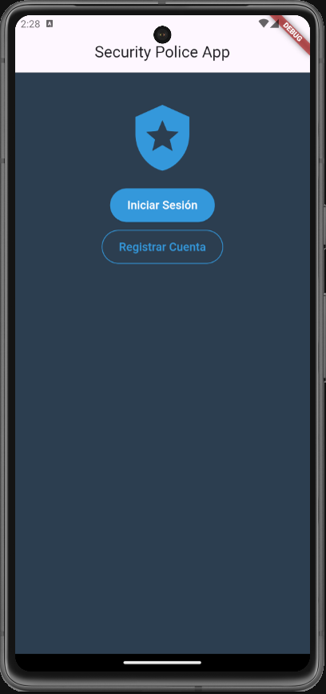

# Security Police App

## Descripción

La aplicación **Security Police App** está diseñada para la gestión de incidentes por parte de personal policial. Permite a los usuarios registrar y visualizar incidentes, gestionar su perfil y agregar nuevos reportes.

## Características

- **Inicio de sesión**: Autenticación de usuarios.
- **Lista de incidentes**: Visualización de incidentes asociados al usuario.
- **Detalles del incidente**: Información completa sobre cada incidente.
- **Agregar incidente**: Funcionalidad para añadir nuevos incidentes.
- **Perfil del usuario**: Gestión y visualización de la información del perfil del usuario.

## Tecnologías Utilizadas

- **Flutter**: Framework para el desarrollo de la aplicación.
- **SQLite**: Base de datos local para almacenar datos.
- **GetIt**: Paquete para la inyección de dependencias.
- **Provider**: Gestión del estado de la aplicación.
- **Dart**: Lenguaje de programación utilizado.

## Estructura del Proyecto

- `lib/`
  - `main.dart`: Punto de entrada de la aplicación.
  - `models/`: Contiene las definiciones de los modelos de datos.
  - `repositories/`: Repositorios para acceder a los datos.
  - `screens/`: Pantallas de la aplicación.
  - `components/`: Componentes reutilizables de la interfaz.
  - `utils/`: Utilidades y validadores.
  - `database/`: Manejo de la base de datos local.

## Uso

1. **Iniciar sesión**: Introduce tus credenciales en la pantalla de inicio de sesión.
2. **Ver incidentes**: Navega a la pantalla de lista de incidentes para ver todos los incidentes registrados.
3. **Agregar un incidente**: Usa el botón flotante para agregar un nuevo incidente.
4. **Ver detalles**: Toca cualquier incidente en la lista para ver más detalles.

## Contribuciones

Las contribuciones son bienvenidas. Por favor, sigue estos pasos para contribuir al proyecto:

1. **Hacer un fork del repositorio**
2. **Crear una rama para tus cambios**
3. **Realizar los cambios y realizar commit**
4. **Hacer un pull request**
